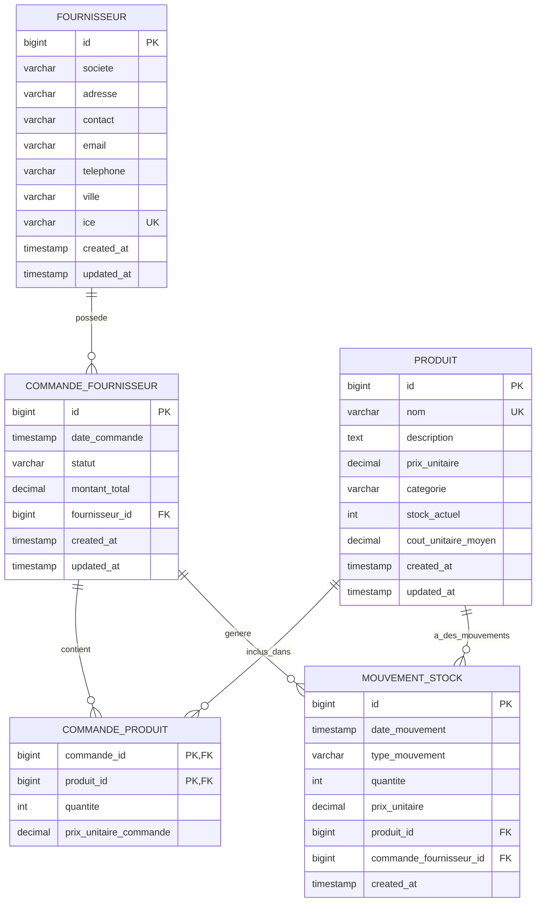
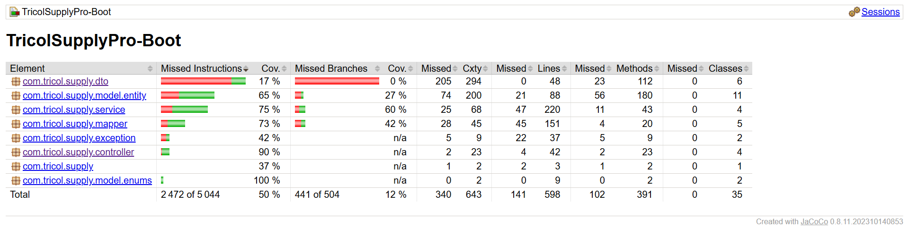

<div align="center">

# 🏭 TricolSupplyPro-Boot

### 📦 Système de Gestion des Approvisionnements

[](https://spring.io/projects/spring-boot)
[](https://www.oracle.com/java/)
[](https://www.postgresql.org/)
[]()

*API REST moderne pour la gestion complète des commandes fournisseurs et du stock*

[Fonctionnalités](#-fonctionnalités) • [Installation](#-installation) • [API Documentation](#-api-rest) • [Technologies](#-stack-technique)

</div>

---

## 📋 Table des matières

- [À propos](#-à-propos)
- [Fonctionnalités](#-fonctionnalités)
- [Stack Technique](#-stack-technique)
- [Architecture](#-architecture)
- [Installation](#-installation)
- [API REST](#-api-rest)
- [Base de données](#-base-de-données)
- [Configuration](#-configuration)
- [Règles métier](#-règles-métier)
- [Tests](#-tests)

---

## 🎯 À propos

**TricolSupplyPro-Boot** est une application de gestion des approvisionnements développée pour **Tricol**, entreprise spécialisée dans la conception et la fabrication de vêtements professionnels.

### 🏢 Contexte

Après avoir mis en place le module de gestion des fournisseurs, Tricol souhaite digitaliser la gestion de ses commandes fournisseurs pour assurer un suivi rigoureux des approvisionnements en matières premières et équipements.

### 🎯 Objectif

Développer une **API REST complète** permettant de gérer l'ensemble du cycle de vie des commandes fournisseurs, depuis leur création jusqu'à leur suivi, avec une **gestion automatique des mouvements de stock** et de la **valorisation des coûts** (méthode CUMP).

---

## ✨ Fonctionnalités

### 👥 Gestion des Fournisseurs
- ✅ CRUD complet (Créer, Lire, Modifier, Supprimer)
- ✅ Pagination et tri dynamique
- ✅ Validation des données (email, ICE unique)
- 📊 **Informations gérées** : société, adresse, contact, email, téléphone, ville, ICE

### 📦 Gestion des Produits
- ✅ CRUD complet avec validation
- ✅ Suivi du stock en temps réel
- ✅ Calcul automatique du coût unitaire moyen (CUMP)
- ✅ Pagination et filtrage avancé
- 📊 **Informations gérées** : nom, description, prix unitaire, catégorie, stock actuel

### 🛒 Gestion des Commandes Fournisseurs
- ✅ Création de commandes multi-produits
- ✅ Calcul automatique du montant total
- ✅ Modification (uniquement si `EN_ATTENTE`)
- ✅ Suppression sécurisée (uniquement si `EN_ATTENTE` ou `ANNULEE`)
- ✅ Gestion des statuts : `EN_ATTENTE` → `VALIDEE` → `LIVREE` / `ANNULEE`
- ✅ Consultation par fournisseur
- ✅ Pagination et tri personnalisable

### 📊 Gestion des Mouvements de Stock
- ✅ Création automatique lors de la livraison d'une commande
- ✅ Mise à jour automatique des quantités en stock
- ✅ Types de mouvements : `ENTREE`, `SORTIE`, `AJUSTEMENT`
- ✅ Historique complet par produit ou par commande
- ✅ Traçabilité totale avec horodatage

### 💰 Valorisation du Stock (CUMP)
- ✅ Calcul automatique du **Coût Unitaire Moyen Pondéré**
- ✅ Formule : `CUMP = (Valeur stock ancien + Valeur entrée) / Stock total`
- ✅ Mise à jour en temps réel à chaque entrée de stock
- ✅ Précision décimale (2 chiffres après la virgule)

---

## 🛠 Stack Technique

### 🔧 Backend & Framework
| Technologie | Version | Description |
|------------|---------|-------------|
|  | 3.5.7 | Framework principal |
|  | 3.5.7 | Accès aux données |
|  | 17 | Langage de programmation |

### 🗄️ Base de données
| Technologie | Version | Description |
|------------|---------|-------------|
|  | 12+ | Base de données relationnelle |
|  | Latest | Gestion des migrations |

### 📝 Mapping & Validation
| Technologie | Version | Description |
|------------|---------|-------------|
|  | 1.5.5 | Mapping Entity ↔ DTO |
|  | Latest | Réduction du code boilerplate |
|  | 3.0 | Validation des données |

### 📚 Documentation
| Technologie | Version | Description |
|------------|---------|-------------|
|  | 2.3.0 | Documentation API interactive |
|  | 3.0 | Spécification API |

---

## 🏗 Architecture

### 📐 Architecture en couches

```
┌─────────────────────────────────────────────────┐
│              🌐 REST Controllers                │
│         (Endpoints API - Validation)            │
└────────────────┬────────────────────────────────┘
                 │
                 ▼
┌─────────────────────────────────────────────────┐
│              📋 DTOs (Data Transfer)            │
│         (FournisseurDTO, ProduitDTO...)         │
└────────────────┬────────────────────────────────┘
                 │
                 ▼ MapStruct
┌─────────────────────────────────────────────────┐
│              🔄 Mappers                         │
│    (Conversion automatique Entity ↔ DTO)        │
└────────────────┬────────────────────────────────┘
                 │
                 ▼
┌─────────────────────────────────────────────────┐
│              💼 Services                        │
│         (Logique métier - CUMP)                 │
└────────────────┬────────────────────────────────┘
                 │
                 ▼
┌─────────────────────────────────────────────────┐
│              🗃️ Repositories                    │
│         (Spring Data JPA)                       │
└────────────────┬────────────────────────────────┘
                 │
                 ▼
┌─────────────────────────────────────────────────┐
│              🐘 PostgreSQL Database             │
│         (Tables + Liquibase)                    │
└─────────────────────────────────────────────────┘
```

### 📦 Structure des packages

```
com.tricol.supply
├── 📂 controller/          # Contrôleurs REST
├── 📂 service/             # Logique métier
├── 📂 repository/          # Accès aux données
├── 📂 model/
│   ├── 📂 entity/          # Entités JPA
│   └── 📂 enums/           # Énumérations
├── 📂 dto/                 # Data Transfer Objects
├── 📂 mapper/              # Mappers MapStruct
└── 📂 exception/           # Gestion des exceptions
```

---

## 🚀 Installation

### 📋 Prérequis

Avant de commencer, assurez-vous d'avoir installé :

- ☕ **Java 17** ou supérieur
- 🐘 **PostgreSQL 12** ou supérieur
- 📦 **Maven 3.8** ou supérieur
- 🔧 **Git** (pour cloner le projet)

### 📥 Étape 1 : Cloner le projet

```bash
git clone https://github.com/votre-repo/TricolSupplyPro-Boot.git
cd TricolSupplyPro-Boot
```

### 🗄️ Étape 2 : Créer la base de données

Connectez-vous à PostgreSQL et exécutez :

```sql
CREATE DATABASE tricolsupplyboot;
```

### ⚙️ Étape 3 : Configuration

Modifiez le fichier `src/main/resources/application.properties` :

```properties
# Configuration PostgreSQL
spring.datasource.url=jdbc:postgresql://localhost:5432/tricolsupplyboot
spring.datasource.username=votre_username
spring.datasource.password=votre_password
```

### 🔨 Étape 4 : Compiler et lancer

```bash
# Compiler le projet
mvn clean install

# Lancer l'application
mvn spring-boot:run
```

### ✅ Étape 5 : Vérifier l'installation

L'application sera accessible sur :

- 🌐 **API** : http://localhost:8080
- 📚 **Swagger UI** : http://localhost:8080/swagger-ui.html
- 📄 **API Docs** : http://localhost:8080/api-docs

---

## 🌐 API REST

### 📚 Documentation interactive

Une fois l'application démarrée, accédez à la documentation Swagger :

🔗 **http://localhost:8080/swagger-ui.html**

### 🔌 Endpoints disponibles

#### 👥 Fournisseurs

| Méthode | Endpoint | Description |
|---------|----------|-------------|
| `GET` | `/api/v1/fournisseurs` | 📋 Liste paginée des fournisseurs |
| `GET` | `/api/v1/fournisseurs/{id}` | 🔍 Détails d'un fournisseur |
| `POST` | `/api/v1/fournisseurs` | ➕ Créer un fournisseur |
| `PUT` | `/api/v1/fournisseurs/{id}` | ✏️ Modifier un fournisseur |
| `DELETE` | `/api/v1/fournisseurs/{id}` | 🗑️ Supprimer un fournisseur |

#### 📦 Produits

| Méthode | Endpoint | Description |
|---------|----------|-------------|
| `GET` | `/api/v1/produits` | 📋 Liste paginée des produits |
| `GET` | `/api/v1/produits/{id}` | 🔍 Détails d'un produit |
| `POST` | `/api/v1/produits` | ➕ Créer un produit |
| `PUT` | `/api/v1/produits/{id}` | ✏️ Modifier un produit |
| `DELETE` | `/api/v1/produits/{id}` | 🗑️ Supprimer un produit |

#### 🛒 Commandes Fournisseurs

| Méthode | Endpoint | Description |
|---------|----------|-------------|
| `GET` | `/api/v1/commandes` | 📋 Liste paginée des commandes |
| `GET` | `/api/v1/commandes/{id}` | 🔍 Détails d'une commande |
| `GET` | `/api/v1/commandes/fournisseur/{id}` | 🏢 Commandes par fournisseur |
| `POST` | `/api/v1/commandes` | ➕ Créer une commande |
| `PUT` | `/api/v1/commandes/{id}` | ✏️ Modifier une commande |
| `DELETE` | `/api/v1/commandes/{id}` | 🗑️ Supprimer une commande |
| `PATCH` | `/api/v1/commandes/{id}/statut` | 🔄 Changer le statut |

#### 📊 Mouvements de Stock

| Méthode | Endpoint | Description |
|---------|----------|-------------|
| `GET` | `/api/v1/mouvements/produit/{produitId}` | 📦 Mouvements par produit |
| `GET` | `/api/v1/mouvements/commande/{commandeId}` | 🛒 Mouvements par commande |

### 📄 Exemples de requêtes

#### Créer un fournisseur

```http
POST /api/v1/fournisseurs
Content-Type: application/json

{
  "societe": "Textile Pro SA",
  "adresse": "123 Rue de l'Industrie",
  "contact": "Mohammed Alami",
  "email": "contact@textilepro.ma",
  "telephone": "0522123456",
  "ville": "Casablanca",
  "ice": "001234567890123"
}
```

#### Créer une commande

```http
POST /api/v1/commandes
Content-Type: application/json

{
  "fournisseurId": 1,
  "produits": [
    {
      "produitId": 1,
      "quantite": 100,
      "prixUnitaireCommande": 25.50
    },
    {
      "produitId": 2,
      "quantite": 50,
      "prixUnitaireCommande": 15.00
    }
  ]
}
```

#### Changer le statut d'une commande

```http
PATCH /api/v1/commandes/1/statut?statut=LIVREE
```

### 🔍 Pagination et tri

Tous les endpoints de liste supportent la pagination :

```http
GET /api/v1/fournisseurs?page=0&size=10&sort=societe,asc
```

**Paramètres** :
- `page` : Numéro de la page (commence à 0)
- `size` : Nombre d'éléments par page (défaut : 10)
- `sort` : Champ de tri + direction (`asc` ou `desc`)

**Réponse** :
```json
{
  "content": [...],
  "totalElements": 50,
  "totalPages": 5,
  "size": 10,
  "number": 0
}
```

---

## 🗄️ Base de données

### 📊 Modèle de données



### 🔄 Migrations Liquibase

Les migrations de base de données sont gérées par **Liquibase** :

```
src/main/resources/db/changelog/
├── db.changelog-master.yaml       # Fichier principal
└── migrations/                    # Dossier des migrations
    ├── 003-create-fournisseurs-table.yaml
    ├── 004-create-fournisseurs-indexes.yaml
    ├── 005-create-produits-table.yaml
    ├── 006-create-produits-indexes.yaml
    ├── 007-create-commandes-fournisseur-table.yaml
    ├── 008-create-commandes-fournisseur-indexes.yaml
    ├── 009-create-commandes-produits-table.yaml
    ├── 010-create-mouvements-stock-table.yaml
    └── 011-create-mouvements-stock-indexes.yaml
```

Liquibase s'exécute automatiquement au démarrage de l'application.

---

## ⚙️ Configuration

### 📝 application.properties

```properties
# ========================================
# Configuration PostgreSQL
# ========================================
spring.datasource.url=jdbc:postgresql://localhost:5432/tricolsupplyboot
spring.datasource.username=postgres
spring.datasource.password=admin
spring.datasource.driver-class-name=org.postgresql.Driver

# ========================================
# Configuration JPA/Hibernate
# ========================================
spring.jpa.hibernate.ddl-auto=none
spring.jpa.show-sql=true
spring.jpa.properties.hibernate.format_sql=true
spring.jpa.properties.hibernate.dialect=org.hibernate.dialect.PostgreSQLDialect

# ========================================
# Configuration Liquibase
# ========================================
spring.liquibase.enabled=true
spring.liquibase.change-log=classpath:db/changelog/db.changelog-master.yaml

# ========================================
# Configuration Swagger/OpenAPI
# ========================================
springdoc.api-docs.path=/api-docs
springdoc.swagger-ui.path=/swagger-ui.html
springdoc.swagger-ui.operationsSorter=method

# ========================================
# Configuration Serveur
# ========================================
server.port=8080

# ========================================
# Configuration Logging
# ========================================
logging.level.com.tricol.supply=DEBUG
logging.level.org.springframework.web=INFO
logging.level.org.hibernate.SQL=DEBUG
```

---

## 📜 Règles métier

### 🛒 Gestion des Commandes

#### ✏️ Modification
- ⚠️ Seules les commandes avec le statut `EN_ATTENTE` peuvent être modifiées
- ✅ Tous les champs peuvent être mis à jour (fournisseur, produits, quantités)

#### 🗑️ Suppression
- ⚠️ Seules les commandes `EN_ATTENTE` ou `ANNULEE` peuvent être supprimées
- ❌ Les commandes `VALIDEE` ou `LIVREE` ne peuvent pas être supprimées

#### 🔄 Changement de statut
- `EN_ATTENTE` → `VALIDEE` → `LIVREE` ✅
- `EN_ATTENTE` → `ANNULEE` ✅
- `VALIDEE` → `ANNULEE` ✅
- `LIVREE` → Statut final (aucun changement possible) 🔒

### 📊 Gestion du Stock

#### 📥 Entrées automatiques
- Lorsqu'une commande passe au statut `LIVREE`, des mouvements de type `ENTREE` sont créés automatiquement
- Le stock de chaque produit est mis à jour : `stock_actuel += quantite`

#### 💰 Calcul du CUMP
Formule appliquée à chaque entrée :

```
CUMP = (Valeur stock ancien + Valeur entrée) / Stock total

Où :
- Valeur stock ancien = stock_ancien × cout_ancien
- Valeur entrée = quantite_entree × prix_unitaire_entree
- Stock total = stock_ancien + quantite_entree
```

**Exemple** :
- Stock actuel : 100 unités à 10€ = 1000€
- Entrée : 50 unités à 12€ = 600€
- Nouveau CUMP = (1000€ + 600€) / 150 = **10,67€**

#### 📜 Traçabilité
- Chaque mouvement est horodaté avec `date_mouvement` et `created_at`
- Référence à la commande source (`commande_fournisseur_id`)
- Historique complet consultable par produit ou par commande

---

## 🧪 Tests

### 📋 Stratégie de test

Le projet utilise une **stratégie de test en deux niveaux** pour garantir la qualité et la fiabilité du code :

#### 1. Tests unitaires (`src/test/java/com/tricol/supply/service/`)

Les tests unitaires vérifient la logique métier isolée des dépendances externes :

- **Framework** : JUnit 5 + Mockito
- **Objectif** : Tester la logique métier des services de manière isolée
- **Technique** : Mocking des repositories et dépendances
- **Couverture** : Tous les services métier (Fournisseur, Produit, Commande, MouvementStock)

**Tests unitaires disponibles** :
- ✅ `FournisseurServiceTest.java` - Tests CRUD et validation
- ✅ `ProduitServiceTest.java` - Tests CRUD, stock et calcul CUMP
- ✅ `CommandeFournisseurServiceTest.java` - Tests création, modification, statuts
- ✅ `MouvementStockServiceTest.java` - Tests création et historique

#### 2. Tests d'intégration (`src/test/java/com/tricol/supply/integration/`)

Les tests d'intégration vérifient le comportement end-to-end de l'API REST :

- **Framework** : Spring Boot Test + MockMvc
- **Base de données** : H2 (en mémoire) pour l'isolation
- **Objectif** : Tester les endpoints REST, la sérialisation JSON et l'intégration complète
- **Profil** : Utilise le profil `test` défini dans `application-test.properties`

**Tests d'intégration disponibles** :
- ✅ `FournisseurControllerIntegrationTest.java` - Tests des endpoints `/api/v1/fournisseurs`
- ✅ `ProduitControllerIntegrationTest.java` - Tests des endpoints `/api/v1/produits` (incluant CUMP)
- ✅ `CommandeFournisseurControllerIntegrationTest.java` - Tests des endpoints `/api/v1/commandes`
- ✅ `MouvementStockControllerIntegrationTest.java` - Tests des endpoints `/api/v1/mouvements`

#### 3. Tests d'intégration API (Postman)

Une collection Postman complète permet de tester manuellement tous les endpoints de l'API :

- **Fichier** : `TricolSupplyPro.postman_collection.json`
- **Couverture** : Tous les endpoints CRUD + opérations métier
- **Utilisation** : Import dans Postman pour tests manuels ou automatisés

### 🚀 Commandes pour exécuter les tests

#### Exécuter tous les tests

```bash
# Avec Maven Wrapper (recommandé)
./mvnw test

# Ou avec Maven installé
mvn test
```

#### Exécuter uniquement les tests unitaires

```bash
./mvnw test -Dtest=*ServiceTest
```

#### Exécuter uniquement les tests d'intégration

```bash
./mvnw test -Dtest=*IntegrationTest
```

#### Générer le rapport de couverture JaCoCo

```bash
# Exécuter les tests et générer le rapport
./mvnw test jacoco:report

# Nettoyer, tester et générer le rapport
./mvnw clean test jacoco:report
```

**Emplacement du rapport** : `target/site/jacoco/index.html`

Ouvrez ce fichier dans votre navigateur pour visualiser le rapport de couverture interactif.

### 📊 Interprétation des résultats

#### Résultats des tests

Après l'exécution, vous verrez dans le terminal :

```
[INFO] Tests run: 56, Failures: 0, Errors: 0, Skipped: 0
[INFO] 
[INFO] ------------------------------------------------------------------------
[INFO] BUILD SUCCESS
[INFO] ------------------------------------------------------------------------
```

**Répartition des tests** :
- ✅ **Tests d'intégration** : 23 tests (CommandeFournisseur, Fournisseur, MouvementStock, Produit)
- ✅ **Tests unitaires** : 33 tests (CommandeFournisseurService, FournisseurService, MouvementStockService, ProduitService)

**Indicateurs** :
- ✅ **Tests run** : Nombre total de tests exécutés
- ❌ **Failures** : Tests qui ont échoué (devrait être 0)
- ⚠️ **Errors** : Erreurs d'exécution (devrait être 0)
- ⏭️ **Skipped** : Tests ignorés (normal si certains tests sont désactivés)

#### Rapport de couverture JaCoCo

Le rapport JaCoCo fournit une analyse détaillée de la couverture de code :

**Métriques principales** :

| Métrique | Description | Objectif | Résultat actuel |
|----------|-------------|----------|-----------------|
| **Instructions** | Pourcentage d'instructions exécutées | ≥ 50% | **50%** (2,572 / 5,044) ✅ |
| **Branches** | Pourcentage de branches testées (if/else, switch) | ≥ 50% | **12%** (63 / 504) ⚠️ |
| **Lines** | Pourcentage de lignes de code exécutées | ≥ 50% | **76%** (457 / 598) ✅ |
| **Methods** | Pourcentage de méthodes testées | ≥ 50% | **74%** (289 / 391) ✅ |
| **Classes** | Pourcentage de classes testées | 100% | **100%** (35 / 35) ✅ |

**Aperçu visuel** :



**Interprétation** :

- 🟢 **≥ 80%** : Excellente couverture
- 🟡 **50-79%** : Couverture acceptable (seuil minimum configuré)
- 🔴 **< 50%** : Couverture insuffisante (le build échouera)

**Navigation dans le rapport** :

1. **Vue d'ensemble** : Page d'accueil avec le pourcentage global de couverture
2. **Par package** : Détails de couverture par package (`com.tricol.supply.service`, `com.tricol.supply.controller`, etc.)
3. **Par classe** : Couverture ligne par ligne avec code source coloré :
   - 🟢 **Vert** : Lignes couvertes par les tests
   - 🔴 **Rouge** : Lignes non couvertes
   - 🟡 **Jaune** : Branches partiellement couvertes

**Exemple d'interprétation (basé sur le rapport actuel)** :

```
Total: 50% instructions, 12% branches
├── controller/ : 90% instructions ✅ (excellente couverture)
├── model.enums/ : 100% instructions ✅ (couverture complète)
├── service/ : 75% instructions, 60% branches ✅ (bonne couverture)
├── mapper/ : 73% instructions, 42% branches ✅ (acceptable)
├── model.entity/ : 65% instructions, 27% branches ✅ (acceptable)
├── exception/ : 42% instructions ⚠️ (à améliorer)
└── dto/ : 17% instructions ⚠️ (faible couverture - normal pour les DTOs)
```

**Note** : Les DTOs ont généralement une faible couverture car ce sont principalement des classes de données (getters/setters) qui sont testées indirectement via les tests d'intégration des contrôleurs.

**Actions recommandées** :
- ✅ **Instructions (50%)** : Objectif atteint, au seuil minimum. Maintenir et améliorer si possible.
- ⚠️ **Branches (12%)** : Faible couverture. Améliorer en testant plus de conditions (if/else, switch, exceptions).
- ✅ **Lines (76%)** : Bonne couverture, continuer à maintenir.
- ✅ **Methods (74%)** : Bonne couverture, continuer à maintenir.
- ✅ **Classes (100%)** : Toutes les classes sont testées, excellent !

**Points d'attention** :
- 🔍 **Branches** : La couverture des branches est faible (12%). Ajouter des tests pour les cas d'erreur, les validations, et les conditions alternatives.
- 📦 **DTOs** : La faible couverture des DTOs (17%) est acceptable car ils sont testés indirectement via les tests d'intégration.
- 🎯 **Priorité** : Se concentrer sur l'amélioration de la couverture des branches pour atteindre au moins 50%.

### 📮 Collection Postman

Une collection Postman complète est disponible pour tester tous les endpoints de l'API :

📁 **Fichier** : `TricolSupplyPro.postman_collection.json`

**Comment l'utiliser** :
1. Ouvrir Postman
2. Cliquer sur **Import**
3. Sélectionner le fichier `TricolSupplyPro.postman_collection.json`
4. La collection contient tous les endpoints avec des exemples de requêtes

**Endpoints inclus** :
- ✅ **Fournisseurs** : CRUD complet (5 requêtes)
- ✅ **Produits** : CRUD complet (5 requêtes)
- ✅ **Commandes Fournisseurs** : CRUD + changement de statut (7 requêtes)
- ✅ **Mouvements de Stock** : Consultation par produit/commande (2 requêtes)

**Variable d'environnement** :
- `baseUrl` : `http://localhost:8080/api/v1` (modifiable selon votre configuration)

**Vérification de la collection** :
✅ La collection Postman est **correcte et complète**. Elle contient :
- Tous les endpoints documentés dans l'API
- Des exemples de requêtes valides avec données de test
- Les méthodes HTTP appropriées (GET, POST, PUT, DELETE, PATCH)
- Les en-têtes nécessaires (Content-Type: application/json)
- La variable d'environnement `baseUrl` pour faciliter les tests

---

## ✅ Validation des données

### 🔒 Contraintes de validation

#### Fournisseur
- ✅ `societe` : obligatoire, max 255 caractères
- ✅ `email` : format email valide
- ✅ `ice` : unique, 15 caractères
- ✅ `telephone` : format valide

#### Produit
- ✅ `nom` : obligatoire, unique, max 255 caractères
- ✅ `prixUnitaire` : obligatoire, > 0
- ✅ `stockActuel` : >= 0

#### Commande
- ✅ `fournisseurId` : obligatoire, doit exister
- ✅ `produits` : liste non vide
- ✅ `quantite` : > 0
- ✅ `prixUnitaireCommande` : > 0

### 🚨 Gestion des erreurs

L'API retourne des réponses JSON structurées :

```json
{
  "timestamp": "2025-11-07T21:23:45",
  "status": 400,
  "error": "Bad Request",
  "message": "Le fournisseur avec l'ID 999 n'existe pas",
  "path": "/api/v1/commandes"
}
```

**Codes HTTP** :
- `200` : Succès
- `201` : Ressource créée
- `400` : Erreur de validation
- `404` : Ressource non trouvée
- `500` : Erreur serveur

**📋 Valeurs des Enums** :
- Consultez le fichier `API_ENUMS.md` pour la liste complète des valeurs acceptées pour `StatutCommande` et `TypeMouvement`

**📦 Logique des Mouvements de Stock** :
- Consultez le fichier `LOGIQUE_MOUVEMENTS_STOCK.md` pour comprendre le workflow complet des mouvements de stock

---

## 📚 Documentation complémentaire

### 📄 Documentation projet

- 📦 **[LOGIQUE_MOUVEMENTS_STOCK.md](LOGIQUE_MOUVEMENTS_STOCK.md)** - Workflow détaillé des mouvements de stock
- 📋 **[API_ENUMS.md](API_ENUMS.md)** - Liste des valeurs d'énumérations
- 📊 **[Diagram/classDiagram.png](Diagram/classDiagram.png)** - Diagramme de classes UML

### 🔗 Ressources utiles

- 📖 [Spring Boot Documentation](https://spring.io/projects/spring-boot)
- 📖 [Spring Data JPA](https://spring.io/projects/spring-data-jpa)
- 📖 [MapStruct Documentation](https://mapstruct.org/)
- 📖 [Liquibase Documentation](https://docs.liquibase.com/)
- 📖 [Swagger/OpenAPI](https://swagger.io/specification/)

---

## 👨‍💻 Auteur

Développée avec ❤️ par **Fatima-Ezzahra Alouane** pour **Tricol SupplyPro**

### 🔗 Connectez-vous avec moi

[](https://www.linkedin.com/in/fatima-ezzahra-alouane)
[](https://fatima-ezzahra-alouane.vercel.app)

---

<div align="center">

### 🌟 Si ce projet vous a aidé, n'oubliez pas de lui donner une étoile ! ⭐

**[⬆ Retour en haut](#-tricolsupplypro-boot)**

</div>
